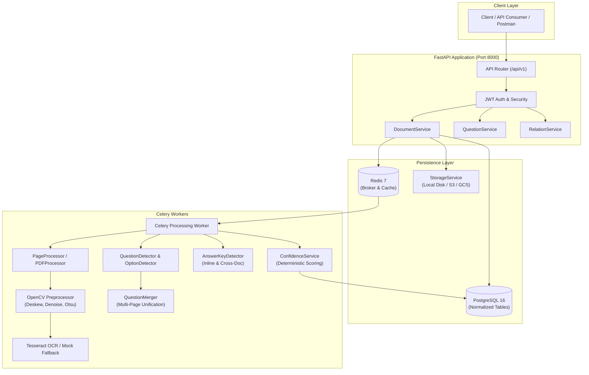
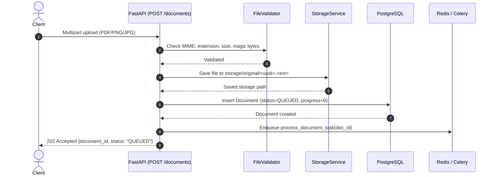

# Document Intelligence & Question Extraction Service — Architecture Documentation

## 1. Overall Architecture

The Document Intelligence & Question Extraction Service is built around an asynchronous, decoupled, layered architecture following Clean Architecture and Dependency Inversion principles.

---

## 2. Request & Authentication Flow

1. **Authentication**:
   - Clients obtain a signed JWT token via `POST /api/v1/auth/login`.
   - Passwords are encrypted using salted `bcrypt`.
   - Protected routes enforce token validation via FastAPI's `Depends(get_current_user)`.
   - Every request is tagged with a unique `X-Request-ID` via middleware and contextual structured logging.

2. **Authorization**:
   - Every document, question, answer, and review item is associated with an `owner_id`.
   - Direct object references are checked at the repository/service layer to prevent IDOR (Insecure Direct Object References).

---

## 3. Document Upload Flow

---

## 4. Asynchronous Processing Pipeline

When the Celery worker picks up a job, it advances through discrete, observable stages:

1. **VALIDATING**: Verifies file accessibility and initializes tracking.
2. **EXTRACTING_TEXT**: Uses PyMuPDF (`fitz`) to test whether high-quality selectable digital text exists.
3. **OCR**: If text is missing or poor (scanned documents or images), pages are rendered at 300 DPI, preprocessed via OpenCV (grayscale, deskew, denoise, Otsu thresholding), and processed by Tesseract OCR.
4. **DETECTING_QUESTIONS**: Discovers question boundaries, numbering formats (`1.`, `Q1.`, `Question 1:`, `(1)`), option structures (`A.`, `(a)`, `1.`), and classifies question types (`MCQ`, `MULTIPLE_SELECT`, `TRUE_FALSE`, `FILL_IN_THE_BLANK`, `SHORT_ANSWER`, `DESCRIPTIVE`, `UNKNOWN`).
5. **QUESTION_MERGING**: Unifies questions spanning page breaks.
6. **MATCHING_ANSWERS**: Detects inline answer keys or queries linked answer-key documents via `DocumentRelation`.
7. **VALIDATING_RESULTS**: Deterministically calculates confidence scores and records granular `ReviewItem` entries.
8. **COMPLETED / PARTIAL**: Updates database state and records total execution duration.

---

## 5. OCR & Image Preprocessing Pipeline

For scanned pages or standalone images, the image preprocessor applies:
1. **Grayscale conversion**: Reduces color channel complexity.
2. **Orientation correction**: Normalizes 90-degree rotations.
3. **Deskew**: Computes minimum bounding box angles on foreground pixels and warps affine to correct tilts up to 45 degrees.
4. **Bilateral Filtering**: Denoises background speckles while preserving sharp font edges.
5. **Otsu Binarization**: Creates high-contrast black-and-white output for optimal Tesseract character recognition.

---

## 6. Multi-Page Question Handling

A major real-world challenge in examination extraction is questions interrupted by page breaks.

* **Detection Signals**:
  - Question text on Page $N$ ends without terminal punctuation (`?`, `.`, `:`) or terminates with a dangling preposition/conjunction (`of`, `the`, `that`, `and`).
  - Question has no detected options on Page $N$, but Page $N+1$ begins with options or an incomplete prompt.
* **Resolution**:
  - `QuestionMerger` concatenates the prompts into a single question.
  - Combines options from Page $N$ and Page $N+1$.
  - Sets `source_start_page = N` and `source_end_page = N+1`.
  - Produces a single unified question entity in the response with `source.pages = [N, N+1]`.
  - If boundary signals had marginal certainty, flags a `MULTI_PAGE_MERGE_UNCERTAIN` review item.

---

## 7. Answer Key Detection & Matching

Answer keys can appear:
- Inline at the end of the question paper.
- In a separate document (e.g. `AnswerKey.pdf`) linked via `POST /api/v1/documents/{id}/relations`.

* **Matching Strategy**:
  - Normalizes question numbers (e.g. `Question 1`, `Q1.`, `(1)` $\to$ `1`).
  - Detects answer formats: `1. A`, `1-B`, `Q1: C`, `1: (D)`.
  - Maps answers to question entities using normalized numbers.
  - Assigns `matching_status`: `MATCHED`, `UNCERTAIN`, or `UNMATCHED`.
  - **Zero Hallucination Guarantee**: If an answer is ambiguous or unavailable, it is never guessed or invented; it is recorded as `UNCERTAIN` or `UNMATCHED` with an accompanying review item.

---

## 8. Deterministic Confidence Scoring

The confidence score is computed between $0.0$ and $1.0$ using a deterministic model:

$$\text{Confidence} = 0.25 \times C_{\text{OCR}} + 0.25 \times C_{\text{Boundary}} + 0.20 \times C_{\text{Option}} + 0.15 \times C_{\text{Completeness}} + 0.15 \times C_{\text{Answer}}$$

* **Thresholds**:
  - `HIGH_CONFIDENCE` $\ge 0.85$
  - `MEDIUM_CONFIDENCE` $\ge 0.65$
  - `LOW_CONFIDENCE` $< 0.65$ (Triggers `REVIEW_REQUIRED` status and generates `ReviewItem` entries)

---

## 9. Database Design

* **users**: User credentials, status, timestamps.
* **documents**: File metadata, hashes, processing metrics, stage, status.
* **document_pages**: Extracted page text, OCR indicators, rendered image paths.
* **questions**: Question numbers, full merged text, classified types, confidence, source page ranges.
* **options**: Normalized option keys (`A`, `B`, etc.), option text, option confidence.
* **answers**: Matched answer values, type, confidence, source document and page, matching status.
* **review_items**: Traceable review issues (`issue_type`, `severity`, `description`, `resolved`).
* **document_relations**: Mappings between Question Papers and Answer Keys.

---

## 10. Scalability & Performance

* **Non-blocking API**: Document uploads return in $<50\text{ms}$ with `202 Accepted`.
* **Worker Scalability**: Celery workers run independently and can scale horizontally across multiple instances or containers.
* **Smart OCR Bypassing**: Digital PDFs with clean vector text bypass expensive rasterization and OCR, saving substantial CPU time and memory.
* **Database Optimization**: Indexed foreign keys, compound indexes (`owner_id, status`), and eager relationship loading (`selectinload`) avoid N+1 query overhead.
